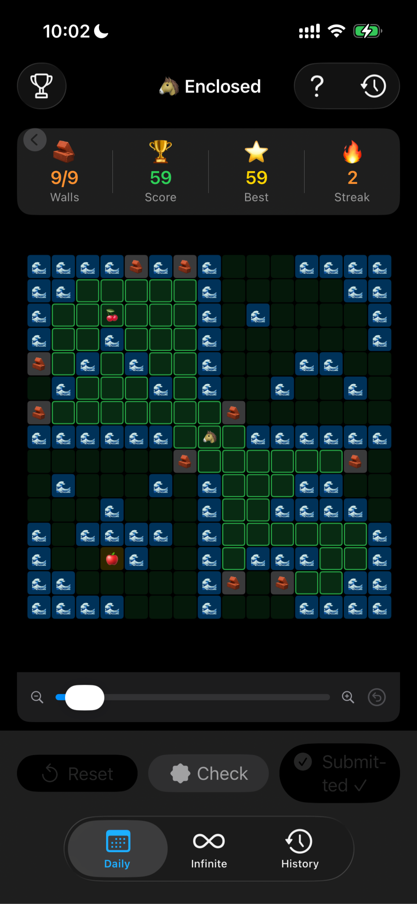
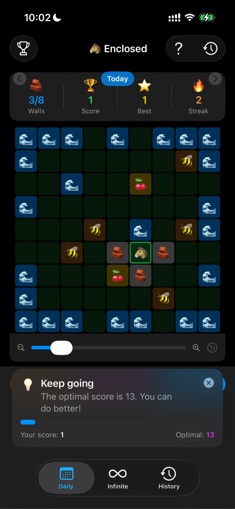
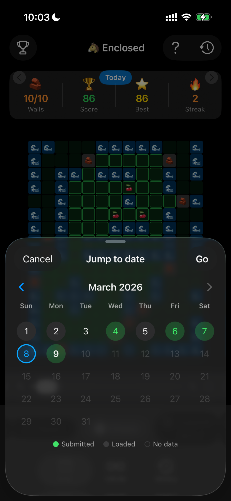
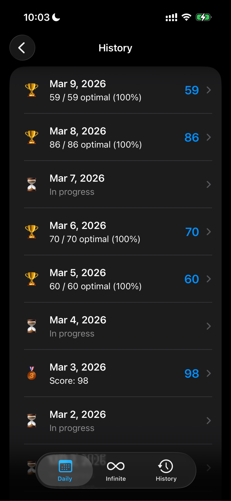
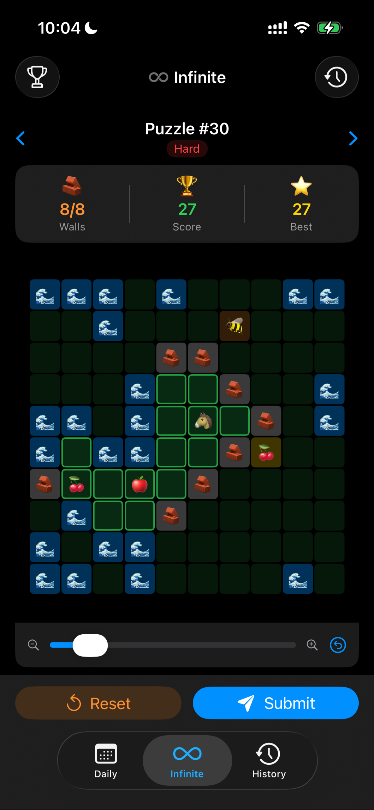
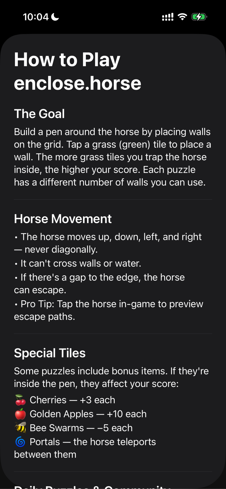

# 🐴 Enclosed for iOS

A native iPhone app for [enclose.horse](https://enclose.horse) — a daily puzzle game where you enclose a horse in the biggest pen you can build with a limited number of walls.

   

---

## Note

This project requires a private configuration file (Constants.swift) with API endpoints that is not included in this repository. To run locally, create EncloseHorse/Constants.swift with the required base URL and Supabase credentials.

---

## Screenshots

<p float="left">
  
  
  
  
  
  
</p>

---

## Why

The browser version works fine on desktop but feels awkward on mobile. Pinch-to-zoom, tap targets, the keyboard popping up — all annoying. This is the game as a proper iPhone app, plus an infinite mode that works offline.

---

## Features

**Daily mode**
- Fetches each day's puzzle via a three-tier strategy: local SwiftData cache → Supabase DB → live scrape. First user each day scrapes and uploads; everyone else reads from the DB instantly
- Offline fallback — if both Supabase and the scraper fail, loads the most recent cached puzzle with an indicator
- Global leaderboard for each day's puzzle
- Streak tracking — consecutive days played

**Infinite mode**
- Procedurally generated puzzles, seeded by puzzle number — puzzle #42 is always the same map on any device
- Gradually harder as puzzle number increases (grid size, wall budget, water density, cherries, bees)
- Per-puzzle leaderboard so scores are directly comparable

**Both modes**
- Pinch-to-zoom and pan with a zoom slider
- Haptic feedback — light tap on wall place/remove, medium thud when enclosure forms, success notification on submit
- Tap cherries, bees, or water to see what they do
- Score and best tracked live as you place walls
- Username set once on first launch, used for both leaderboards

---

## How the scoring works

Scoring runs entirely on-device with a BFS flood fill from the horse's position. For new daily puzzles, the app first checks a Supabase cache — the first user each day loads the page in a hidden WKWebView, reads window.__LEVEL__ via JavaScript, parses it locally, and uploads it so everyone else just hits the DB. After that the scraper is never needed again.


Scoring runs entirely on-device with a BFS flood fill from the horse's position. The horse is enclosed if the BFS cannot step outside the grid boundary. The formula matches the site exactly:

```
score = enclosed tiles + (cherries × 3) − (bees × 5)
```

---

## Backend

Supabase (Postgres) with three tables:

| Table | Purpose |
|---|---|
| `daily_puzzles` | Puzzle cache — first scrape of the day uploads here |
| `daily_scores` | Daily leaderboard, one row per user per day |
| `infinite_scores` | Infinite leaderboard, one row per user per puzzle number |

No auth — scores are identified by a locally stored username. Row-level security allows public read/write with unique constraints preventing duplicate submissions.

---

## Stack

| Layer | Technology |
|---|---|
| Language | Swift 5.9 |
| UI | SwiftUI |
| Persistence | SwiftData |
| Backend | Supabase (Postgres REST API) |
| Web scraping | WKWebView + JavaScript evaluation |
| Minimum deployment | iOS 17 |

---

## Project structure

```
├── EncloseHorse
│   ├── EncloseHorseApp.swift
│   ├── Info.plist
│   ├── Logic
│   │   ├── AuthManager.swift
│   │   ├── GameEngine.swift
│   │   ├── InfinitePuzzleGenerator.swift
│   │   ├── PuzzleScraper.swift
│   │   ├── PuzzleSolver.swift
│   │   ├── ScoreUploadTracker.swift
│   │   ├── SupabaseClient.swift
│   │   └── UsernameManager.swift
│   ├── Models
│   │   └── PuzzleModel.swift
│   ├── Screenshots
│   │   ├── AboutView.PNG
│   │   ├── Calendar.PNG
│   │   ├── CheckButton.PNG
│   │   ├── HistoryView.PNG
│   │   ├── InfiniteView.PNG
│   │   └── PuzzleView.PNG
│   ├── ViewModels
│   │   ├── InfiniteViewModel.swift
│   │   └── PuzzleViewModel.swift
│   └── Views
│       ├── HistoryView.swift
│       ├── InfiniteView.swift
│       ├── LeaderboardView.swift
│       ├── PuzzleView.swift
│       ├── SharedGridComponents.swift
│       └── SignInView.swift

```

---

## Dependency on enclose.horse

The daily puzzle tab scrapes enclose.horse for new puzzles, but once cached in Supabase the app no longer needs the site. Infinite mode is entirely self-contained — the generator, BFS engine, scoring, and persistence are all on-device with no external dependencies.

---

## Background

Built as a side project because the mobile web experience felt clunky. Ended up being a good exercise in reverse-engineering a minified JS bundle to get the scoring logic exactly right, and in building a proper three-tier data fetch strategy around an unofficial scraper.

---

*Not affiliated with enclose.horse or its creator.*

### License

```
MIT License

Copyright (c) 2026 R. Koo

Permission is hereby granted, free of charge, to any person obtaining a copy
of this software and associated documentation files (the "Software"), to deal
in the Software without restriction, including without limitation the rights
to use, copy, modify, merge, publish, distribute, sublicense, and/or sell
copies of the Software, and to permit persons to whom the Software is
furnished to do so, subject to the following conditions:

The above copyright notice and this permission notice shall be included in all
copies or substantial portions of the Software.

THE SOFTWARE IS PROVIDED "AS IS", WITHOUT WARRANTY OF ANY KIND, EXPRESS OR
IMPLIED, INCLUDING BUT NOT LIMITED TO THE WARRANTIES OF MERCHANTABILITY,
FITNESS FOR A PARTICULAR PURPOSE AND NONINFRINGEMENT. IN NO EVENT SHALL THE
AUTHORS OR COPYRIGHT HOLDERS BE LIABLE FOR ANY CLAIM, DAMAGES OR OTHER
LIABILITY, WHETHER IN AN ACTION OF CONTRACT, TORT OR OTHERWISE, ARISING FROM,
OUT OF OR IN CONNECTION WITH THE SOFTWARE OR THE USE OR OTHER DEALINGS IN THE
SOFTWARE.
```
